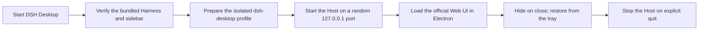

<p align="center">
  
</p>

<h1 align="center">DSH Desktop</h1>

<p align="center"><a href="./README.md">中文</a> · English</p>

<p align="center">
  Bring DeepSeek Harness to the macOS and Windows desktop.<br>
  A bundled local runtime, native window and tray integration, plus a workspace for files, terminals, previews, and Git.
</p>

<p align="center">
  <a href="https://github.com/captainyufei/dsh-desktop/actions/workflows/ci.yml"></a>
  <a href="https://github.com/captainyufei/dsh-desktop/stargazers"></a>
  <a href="./LICENSE"></a>
  
</p>

<p align="center">
  <a href="https://github.com/captainyufei/dsh-desktop/releases">Downloads</a> ·
  <a href="#run-from-source">Run from source</a> ·
  <a href="https://github.com/captainyufei/dsh-desktop/issues">Report an issue</a> ·
  <a href="https://github.com/deepseek-ai/deepseek-harness">DeepSeek Harness</a>
</p>

> [!IMPORTANT]
> DSH Desktop is an unofficial, community-maintained project. It is not affiliated with, endorsed by, or sponsored by DeepSeek. The project packages a pinned version of the official DeepSeek Harness and adds a community workspace sidebar.

<p align="center">
  
</p>

## Why DSH Desktop

| Ready to run | Desktop workspace | Local-first |
| --- | --- | --- |
| Packaged builds include a pinned Harness runtime, so users do not need to install Node.js separately. | The bundled `dsh-better-sidebar` provides file browsing, editing and previews, interactive terminals, Git tools, browser tabs, and background Agent views. | The Harness Host listens only on `127.0.0.1`, while sessions and settings remain under the local `DSH_HOME`. |
| **Native integration** | **Failure recovery** | **Reproducible releases** |
| Native windows, macOS menu-bar and Windows application menus, tray restoration, and explicit quit behavior. | Startup failures and missing runtime files provide retry and log actions, with automatic desktop log rotation. | Harness, the sidebar plugin, and pnpm are pinned; CI builds on target systems and generates SHA-256 checksums. |

<table>
  <tr>
    <td width="33%"></td>
    <td width="33%"></td>
    <td width="33%"></td>
  </tr>
  <tr>
    <td align="center">Conversation</td>
    <td align="center">Compact workspace</td>
    <td align="center">Settings</td>
  </tr>
</table>

## Downloads and supported platforms

The first public GitHub Release has not been published yet. Installers will appear on the [Releases page](https://github.com/captainyufei/dsh-desktop/releases) when they are ready. Do not download builds from third-party sources.

| Platform | Architecture | Artifact | Status |
| --- | --- | --- | --- |
| macOS | Apple silicon (arm64) | DMG | Build configured |
| macOS | Intel (x64) | DMG | Build configured |
| Windows | x64 | NSIS installer (`.exe`) | Build configured |
| Linux | — | — | Not currently supported |

Current builds are unsigned and not notarized. Once a Release is available, download `SHA256SUMS.txt` with the installer and verify it before installation:

```sh
# macOS
shasum -a 256 -c SHA256SUMS.txt
```

```powershell
# Windows PowerShell; compare the output with SHA256SUMS.txt
Get-FileHash '.\path\to\downloaded-installer.exe' -Algorithm SHA256
```

## How it works



DSH Desktop uses an isolated `dsh-desktop` profile and links the bundled sidebar plugin into that profile. The regular `web` profile used by `dsh web` is not modified. Profiles still share session data under the same `DSH_HOME`, while API and interface settings can remain profile-specific.

## Local data and privacy

- Default data directory: `~/.dsh`
- Custom data directory: set the officially supported `DSH_HOME` environment variable before launch
- Host address: `127.0.0.1` only
- External links: opened by the operating system instead of navigating inside the Harness window

Desktop lifecycle logs are stored separately from Harness data:

- macOS: `~/Library/Application Support/DSH Desktop/logs/desktop.log`
- Windows: `%APPDATA%\DSH Desktop\logs\desktop.log`

The desktop log rotates at startup when it exceeds 2 MiB and retains up to `desktop.1.log`, `desktop.2.log`, and `desktop.3.log`.

<a id="run-from-source"></a>

## Run from source

Requirements: Node.js 24 and pnpm 10.29.2.

```sh
git clone https://github.com/captainyufei/dsh-desktop.git
cd dsh-desktop
corepack enable
pnpm install --frozen-lockfile
pnpm dev
```

Common validation and build commands:

| Command | Purpose |
| --- | --- |
| `pnpm test` | Run the isolated unit test suite |
| `pnpm typecheck` | Run TypeScript type checking |
| `pnpm build` | Build the Electron main-process code |
| `pnpm test:smoke` | Run the real pinned Harness smoke test |
| `pnpm package` | Produce an unpacked build for the current platform and architecture |
| `pnpm dist:mac:arm64` | Build a DMG on macOS arm64 |
| `pnpm dist:mac:x64` | Build a DMG on macOS x64 |
| `pnpm dist:win:x64` | Build an NSIS installer on Windows x64 |

## Troubleshooting

<details>
<summary><strong>Harness startup timed out</strong></summary>

Retry once from the recovery dialog. If startup still fails, choose **Open Logs**, inspect `desktop.log`, confirm that `DSH_HOME` is writable, and check whether endpoint security software is blocking local child processes or loopback connections.

</details>

<details>
<summary><strong>Required Harness runtime files are missing</strong></summary>

This means the application bundle is incomplete or damaged; it does not mean that system Node.js is missing. Download the installer and checksum again, then verify SHA-256. Developers should run `pnpm stage:runtime` and `pnpm verify:runtime` before packaging.

</details>

<details>
<summary><strong>macOS Gatekeeper or Windows SmartScreen warning</strong></summary>

Current builds are unsigned. Continue only when the download source is correct and the SHA-256 checksum matches exactly. Do not disable Gatekeeper or SmartScreen globally.

</details>

## Current scope

The `0.1.x` line does not include automatic updates, cloud sync, mobile remote access, a plugin marketplace, or Linux builds. It remains a local desktop shell around the official Web UI, enhanced with a pinned community workspace sidebar.

## Community

Choose whichever platform is convenient to discuss usage, plugin development, and project progress.

<table>
  <tbody>
    <tr>
      <th align="center">WeChat group</th>
    </tr>
    <tr>
      <td align="center"></td>
    </tr>
  </tbody>
</table>

If you would like to join the technical team, contact us at [captainaigc@gmail.com](mailto:captainaigc@gmail.com).

## Ecosystem links

Projects and developer tools from the DeepSeek Harness ecosystem.

| Project | Description | Links |
| --- | --- | --- |
| DeepSeek Harness Orange Book | A community field guide based on hands-on DeepSeek Harness usage. | [GitHub](https://github.com/alchaincyf/deepseek-harness-orange-book) |
| Awesome DSH Plugin | A curated collection of DeepSeek Harness community plugins. | [GitHub](https://github.com/awesome-dsh-plugin/awesome-dsh-plugin) · [Website](https://awesome-dsh-plugin.com/) |
| dsh-web-ui | DeepSeek Harness Web UI plugins and themes. | [GitHub](https://github.com/zhu1090093659/dsh-web-ui) · [Gallery](https://gallery.dsh-market.com/) |
| dsh-TUI | A full-screen interactive terminal interface for DeepSeek Harness. | [GitHub](https://github.com/ccch1mneyyy/dsh-TUI) |
| Agents-Anywhere | Control coding agents running on your computer from a mobile device. | [GitHub](https://github.com/anywhere-labs/Agents-Anywhere) |
| DSH-better-sidebar | A DeepSeek Harness sidebar workspace integrating files, terminals, Git, and subagents. | [GitHub](https://github.com/omdsh-dev/DSH-better-sidebar) |
| Awesome DeepSeek Harness | A curated list of DeepSeek Harness plugins, tools, and infrastructure. | [GitHub](https://github.com/0xsline/awesome-deepseek-harness) · [Website](https://deepseekdocs.com/) |

## Upstream projects and license

Core Harness functionality—including Agents, models, tools, sessions, and the Web UI—comes from [deepseek-ai/deepseek-harness](https://github.com/deepseek-ai/deepseek-harness). Workspace features come from [omdsh-dev/DSH-better-sidebar](https://github.com/omdsh-dev/DSH-better-sidebar). Thank you to both projects and their contributors.

This project is available under the [MIT License](./LICENSE). See [THIRD_PARTY_NOTICES.md](./THIRD_PARTY_NOTICES.md) for third-party attribution and license notices.
