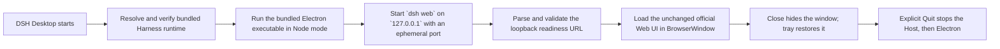

# DSH Desktop

> **Community project:** DSH Desktop is an unofficial community wrapper for DeepSeek Harness. It is not an official DeepSeek product and is not affiliated with or endorsed by DeepSeek.

DSH Desktop runs the pinned, official DeepSeek Harness Web UI in a small native Electron shell. The desktop code owns native window, tray, diagnostics, and Host process lifecycle; it does not replace or modify the Harness UI.

## Supported platforms

| Platform | Architecture | Release artifact |
| --- | --- | --- |
| macOS | Apple silicon (arm64) | DMG |
| macOS | Intel (x64) | DMG |
| Windows | x64 | NSIS installer (`.exe`) |

Release artifacts are currently **unsigned and not notarized**. macOS Gatekeeper and Windows SmartScreen will warn before first launch. Verify the downloaded file against the accompanying `SHA256SUMS.txt` before overriding an operating-system warning. Never override a warning for an artifact whose checksum does not match.

## Install and first launch

Download the artifact that exactly matches your operating system and CPU architecture, along with its checksum file. Verify the SHA-256 checksum, then:

```sh
# macOS, from the directory containing the download
shasum -a 256 -c SHA256SUMS.txt
```

```powershell
# Windows PowerShell; compare this value with SHA256SUMS.txt
Get-FileHash '.\path\to\downloaded-installer.exe' -Algorithm SHA256
```

- On macOS, open the DMG and drag **DSH Desktop** into Applications. On first launch, Control-click the app, choose **Open**, review the warning, and choose **Open** again. If macOS still blocks it, see the Gatekeeper steps below.
- On Windows, run the x64 installer. On the SmartScreen warning, choose **More info**, confirm the publisher is unknown and the checksum is correct, then choose **Run anyway**.

The first launch starts the bundled Harness locally and opens its official Web UI. Closing the window hides it; use the tray/menu-bar item to restore it. Choose **Quit DSH Desktop** from that menu when you want to stop both the desktop shell and its Harness Host.

No system Node.js installation is required by packaged builds.

## How startup works



The Host accepts connections only on loopback. External links are opened by the operating system rather than navigated inside the Harness window.

## Local data and logs

DeepSeek Harness owns its normal data directory. By default, all Harness profiles, sessions, settings, and other user data live under `~/.dsh`. Set the supported `DSH_HOME` environment variable before launch to use another root. DSH Desktop does not copy, migrate, or synchronize that data.

Desktop lifecycle logs are separate:

- macOS: `~/Library/Application Support/DSH Desktop/logs/desktop.log`
- Windows: `%APPDATA%\DSH Desktop\logs\desktop.log`

The desktop log rotates at startup when it exceeds 2 MiB and retains up to `desktop.1.log`, `desktop.2.log`, and `desktop.3.log`. Recovery dialogs offer **Open Logs** to reveal the active file.

## Development

Requirements: Node.js 24 and pnpm 10.29.2.

```sh
pnpm install --frozen-lockfile
pnpm dev
pnpm test
pnpm package
```

`pnpm package` creates an unpacked build for the current platform and architecture. Native installer commands reject a runner that does not match their target:

```sh
pnpm dist:mac:arm64  # macOS arm64 runner only
pnpm dist:mac:x64    # macOS x64 runner only
pnpm dist:win:x64    # Windows x64 runner only
```

Run the real pinned Harness smoke test explicitly with `pnpm test:smoke`. Normal `pnpm test` runs the smoke file in skipped mode so unit tests stay isolated. Release CI generates `dependency-licenses.json` with `pnpm licenses:inventory`; do not replace that generated full inventory with hand-written transitive dependency notices.

## Troubleshooting

### Harness startup timed out

The desktop waits up to 90 seconds for a strict loopback readiness URL. Retry once from the recovery dialog. If it fails again, choose **Open Logs**, check `desktop.log` for the bounded Host startup output, confirm the Harness data location is writable, and make sure endpoint security software is not preventing local child processes or loopback connections.

### Required Harness runtime artifacts are missing

This indicates an incomplete or damaged application bundle, not a missing system Node.js installation. Quit, delete that copy, download the artifact and checksum again, verify the checksum, and reinstall. Developers should run `pnpm stage:runtime` and `pnpm verify:runtime` before packaging.

### Windows SmartScreen

The v1 installer is unsigned, so SmartScreen may report an unknown publisher. Verify `SHA256SUMS.txt`, then choose **More info** and **Run anyway**. If policy managed by your organization prevents that choice, ask its administrator to approve the verified artifact; the project does not recommend disabling SmartScreen globally.

### macOS Gatekeeper

The v1 app is unsigned and not notarized. Verify `SHA256SUMS.txt`, try Control-clicking the app and choosing **Open**, or open **System Settings → Privacy & Security** and use **Open Anyway** for the blocked DSH Desktop launch. Do not disable Gatekeeper globally.

## Explicit v1 limitations

Version 1 has no automatic updates, cloud sync, mobile remote, plugin marketplace, Linux build, or custom UI. It is deliberately a local desktop shell around the unchanged official Web UI.

See [THIRD_PARTY_NOTICES.md](THIRD_PARTY_NOTICES.md) for DeepSeek Harness attribution and license terms.
