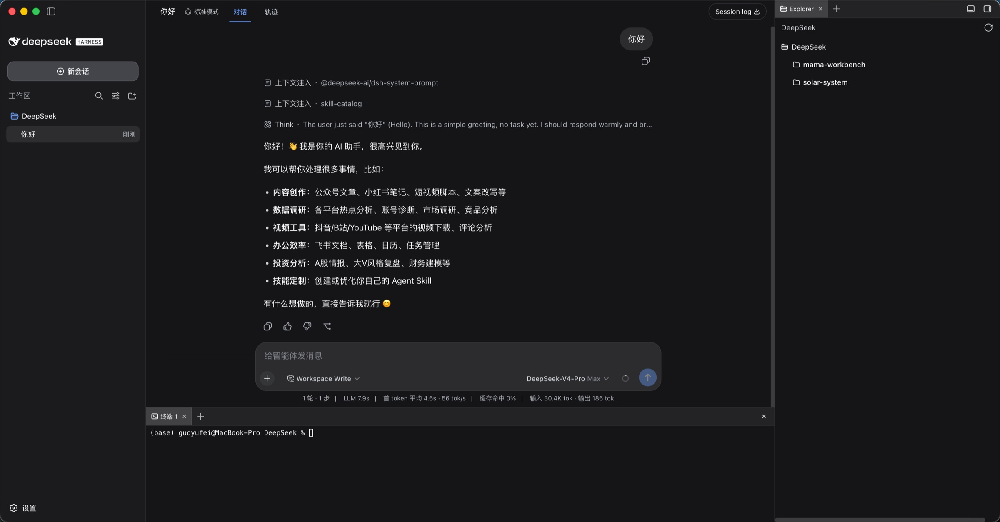
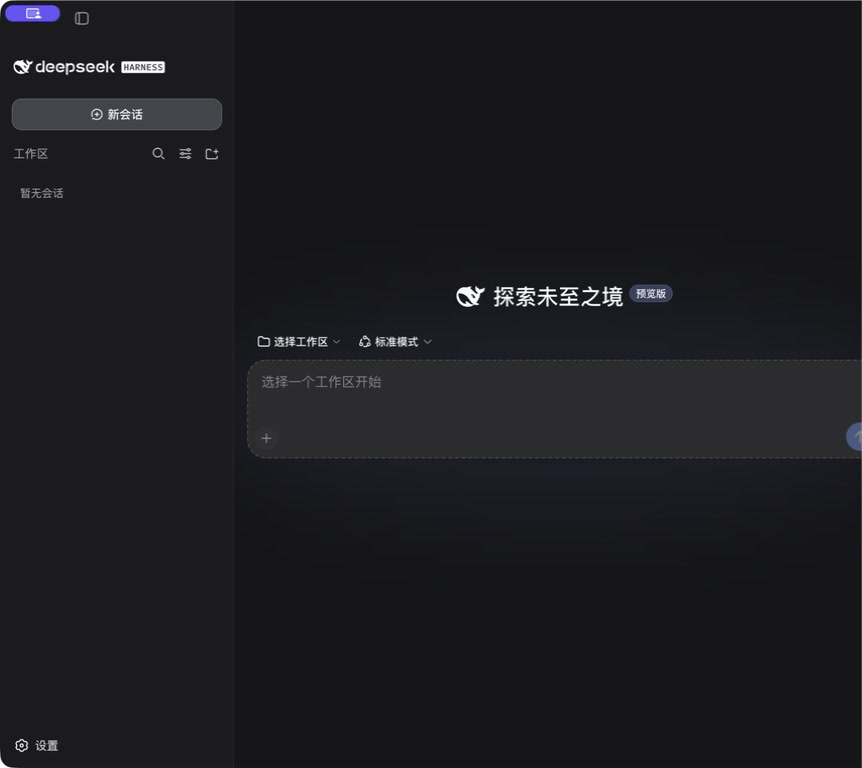
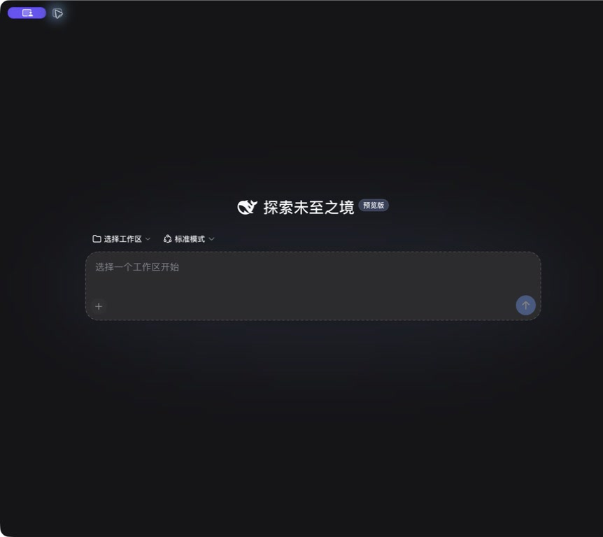
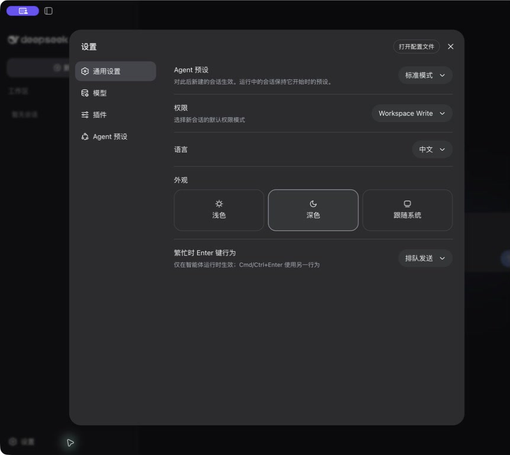
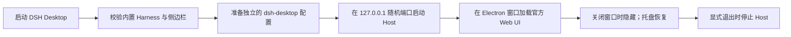

<p align="center">
  
</p>

<h1 align="center">DSH Desktop</h1>

<p align="center">中文 · <a href="./README.en.md">English</a></p>

<p align="center">
  把 DeepSeek Harness 带到 macOS 与 Windows 桌面。<br>
  内置本地运行时、原生窗口与托盘，以及文件、终端、预览和 Git 工作台。
</p>

<p align="center">
  <a href="https://github.com/captainyufei/dsh-desktop/actions/workflows/ci.yml"></a>
  <a href="https://github.com/captainyufei/dsh-desktop/stargazers"></a>
  <a href="./LICENSE"></a>
  
</p>

<p align="center">
  <a href="https://github.com/captainyufei/dsh-desktop/releases">下载</a> ·
  <a href="#从源码运行">从源码运行</a> ·
  <a href="https://github.com/captainyufei/dsh-desktop/issues">问题反馈</a> ·
  <a href="https://github.com/deepseek-ai/deepseek-harness">DeepSeek Harness</a>
</p>

> [!IMPORTANT]
> DSH Desktop 是非官方社区项目，与 DeepSeek 官方无隶属、背书或合作关系。项目封装固定版本的官方 DeepSeek Harness，并额外集成社区工作区侧边栏。

<p align="center">
  
</p>

## 为什么用 DSH Desktop

| 开箱即用 | 桌面工作台 | 本地优先 |
| --- | --- | --- |
| 发布包内置固定版本的 Harness 运行时，不要求用户另装 Node.js。 | 内置 `dsh-better-sidebar`，提供文件浏览、编辑与预览、交互终端、Git、浏览器标签页和后台 Agent 视图。 | Harness Host 只监听 `127.0.0.1`；会话与设置继续由本机 `DSH_HOME` 管理。 |
| **原生体验** | **可恢复运行** | **可复现构建** |
| 原生窗口、macOS 菜单栏 / Windows 应用菜单、托盘恢复与显式退出。 | 启动超时或运行时缺失时提供重试和日志入口，桌面日志自动轮转。 | 锁定 Harness、侧边栏插件和 pnpm 版本，CI 在目标系统上构建并生成 SHA-256 校验文件。 |

<table>
  <tr>
    <td width="33%"></td>
    <td width="33%"></td>
    <td width="33%"></td>
  </tr>
  <tr>
    <td align="center">对话</td>
    <td align="center">紧凑工作区</td>
    <td align="center">设置</td>
  </tr>
</table>

## 下载与支持平台

首个公开 GitHub Release 尚未发布。安装包可用后会出现在 [Releases](https://github.com/captainyufei/dsh-desktop/releases)，请不要从第三方来源下载。

| 平台 | 架构 | 产物 | 状态 |
| --- | --- | --- | --- |
| macOS | Apple silicon（arm64） | DMG | 已配置构建 |
| macOS | Intel（x64） | DMG | 已配置构建 |
| Windows | x64 | NSIS 安装程序（`.exe`） | 已配置构建 |
| Linux | — | — | 暂不支持 |

当前构建未签名、未公证。Release 发布后，请同时下载 `SHA256SUMS.txt` 并在安装前校验：

```sh
# macOS
shasum -a 256 -c SHA256SUMS.txt
```

```powershell
# Windows PowerShell；将输出与 SHA256SUMS.txt 对比
Get-FileHash '.\path\to\downloaded-installer.exe' -Algorithm SHA256
```

## 工作方式



DSH Desktop 使用独立的 `dsh-desktop` profile，并把应用内置的侧边栏插件链接到该 profile。普通 `dsh web` 使用的 `web` profile 不会被修改；不同 profile 仍共享同一个 `DSH_HOME` 下的会话数据，但 API 和界面设置可以分别保存。

## 本地数据与隐私

- 默认数据目录：`~/.dsh`
- 自定义目录：启动前设置官方支持的 `DSH_HOME` 环境变量
- Host 监听地址：仅 `127.0.0.1`
- 外部链接：交给系统浏览器打开，不在 Harness 窗口内跳转

桌面生命周期日志与 Harness 数据分开保存：

- macOS：`~/Library/Application Support/DSH Desktop/logs/desktop.log`
- Windows：`%APPDATA%\DSH Desktop\logs\desktop.log`

日志在启动时超过 2 MiB 会轮转，最多保留 `desktop.1.log`、`desktop.2.log` 和 `desktop.3.log`。

## 从源码运行

要求：Node.js 24、pnpm 10.29.2。

```sh
git clone https://github.com/captainyufei/dsh-desktop.git
cd dsh-desktop
corepack enable
pnpm install --frozen-lockfile
pnpm dev
```

常用验证和构建命令：

| 命令 | 用途 |
| --- | --- |
| `pnpm test` | 运行隔离的单元测试 |
| `pnpm typecheck` | TypeScript 类型检查 |
| `pnpm build` | 构建 Electron 主进程代码 |
| `pnpm test:smoke` | 运行真实的固定版本 Harness 冒烟测试 |
| `pnpm package` | 为当前系统和架构生成未打包目录 |
| `pnpm dist:mac:arm64` | 在 macOS arm64 上生成 DMG |
| `pnpm dist:mac:x64` | 在 macOS x64 上生成 DMG |
| `pnpm dist:win:x64` | 在 Windows x64 上生成 NSIS 安装程序 |

## 故障排查

<details>
<summary><strong>Harness 启动超时</strong></summary>

先在恢复对话框中重试一次。若仍然失败，选择“打开日志”，检查 `desktop.log`，确认 `DSH_HOME` 可写，并检查安全软件是否拦截了本地子进程或回环连接。

</details>

<details>
<summary><strong>提示缺少 Harness 运行时文件</strong></summary>

这表示应用包不完整或已损坏，并不表示系统缺少 Node.js。请重新下载安装包与校验文件并核对 SHA-256。开发者应在打包前运行 `pnpm stage:runtime` 和 `pnpm verify:runtime`。

</details>

<details>
<summary><strong>macOS Gatekeeper / Windows SmartScreen 警告</strong></summary>

当前构建未签名。只有在下载来源正确且 SHA-256 完全匹配时，才应按系统提示继续打开；不要全局关闭 Gatekeeper 或 SmartScreen。

</details>

## 当前边界

`0.1.x` 版本不包含自动更新、云同步、手机远程、插件市场或 Linux 构建。它是围绕官方 Web UI 的本地桌面壳，并提供固定版本的社区工作区侧边栏增强。

## 社区交流

可选择常用的平台参与讨论，交流使用问题、插件开发和项目进展。

<table>
  <tbody>
    <tr>
      <th align="center">微信群</th>
    </tr>
    <tr>
      <td align="center"></td>
    </tr>
  </tbody>
</table>

如果你希望加入我们的技术团队，也欢迎通过 [captainaigc@gmail.com](mailto:captainaigc@gmail.com) 联系我们。

## 友情链接

这里收录 DeepSeek Harness 生态项目及开发者工具。

| 项目 | 简介 | 链接 |
| --- | --- | --- |
| DeepSeek Harness 橙皮书 | DeepSeek Harness 社区实测手册。 | [GitHub](https://github.com/alchaincyf/deepseek-harness-orange-book) |
| Awesome DSH Plugin | DeepSeek Harness 社区插件精选列表。 | [GitHub](https://github.com/awesome-dsh-plugin/awesome-dsh-plugin) · [官网](https://awesome-dsh-plugin.com/) |
| dsh-web-ui | DeepSeek Harness Web UI 插件与皮肤合集。 | [GitHub](https://github.com/zhu1090093659/dsh-web-ui) · [展示站](https://gallery.dsh-market.com/) |
| dsh-TUI | DeepSeek Harness 全屏交互式终端界面。 | [GitHub](https://github.com/ccch1mneyyy/dsh-TUI) |
| Agents-Anywhere | 从手机远程控制电脑上的 Coding Agent。 | [GitHub](https://github.com/anywhere-labs/Agents-Anywhere) |
| DSH-better-sidebar | DeepSeek Harness 侧边栏工作台，集成文件、终端、Git 和子代理。 | [GitHub](https://github.com/omdsh-dev/DSH-better-sidebar) |
| Awesome DeepSeek Harness | DeepSeek Harness 插件、工具与基础设施精选列表。 | [GitHub](https://github.com/0xsline/awesome-deepseek-harness) · [官网](https://deepseekdocs.com/) |

## 上游与许可证

核心 Harness、Agent、模型、工具、会话和 Web UI 来自 [deepseek-ai/deepseek-harness](https://github.com/deepseek-ai/deepseek-harness)；工作区能力来自 [omdsh-dev/DSH-better-sidebar](https://github.com/omdsh-dev/DSH-better-sidebar)。感谢两个项目及其贡献者。

本项目采用 [MIT License](./LICENSE)。第三方软件的归属与许可说明见 [THIRD_PARTY_NOTICES.md](./THIRD_PARTY_NOTICES.md)。
